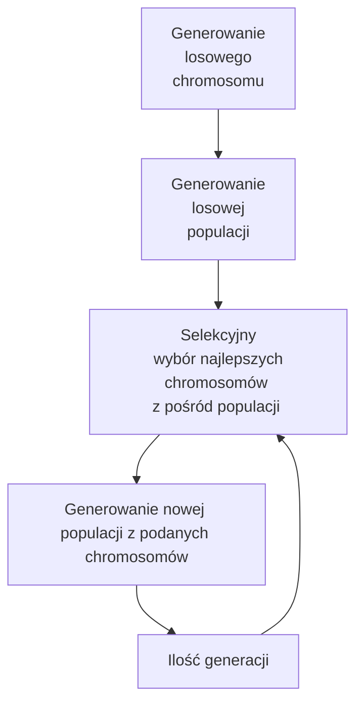

## Raport z części indywidualnej - podprojektu
## Tomasz Lech

### Omówienie projektu

Celem projektu jest znalezienie najoptymalniejszej drogi między zajętymi regałami a miejscami odbioru paczki.
Projekt wykorzystuje wcześniej opracowany algorytm AStar, który jest opisany w pliku [route-planning](https://git.wmi.amu.edu.pl/s444399/AI/src/master/route-planning.md).
Moduł podprojektu uruchamia się po uruchomieniu programu oraz kliknięciu **g** na klawiaturze. Omawiany moduł genetyczny podprojektu w dalszej części raportu będzie się pojawiał w skrócie jako **mdg**.

### Opis składowych elementów wykorzystanych w **mdg**
* Gen - jest to najmniejszy wykorzystywany obiekt, reprezentujący zajęty regał, kóry ma określony koszt do danego miejsca odbioru
* Chromosom - jest to uporządkowany zbiór Genów, który reprezentuje kolejność odbioru paczek, końcowa długość wynika z ilości paczek na magazynie.
* Populacja - jest to zbiór chromosomów.
* Funkcja fitness - funkcja obliczająca całkowity koszt chromosomu.
* Selekcja - składowa odpowiedzialna za wybór najlepszych chromosomów z pośród populacji.
* Crossover - składowa odpowiedzialna za generowanie nowej populacji uwzględniając współczynnik mutacji, wielkość dziedziczonego fragmentu oraz otrzymane podczas selekcji chromosomy.

### Dane wejściowe

Podane przez urzydkownika przed uruchomieniem programu:

* ileGeneracji - wartość, która definiuje ile generacji ma się wykonać po uruchomieniu modułu **mdg**,
* ileWPopulacji - wartość, która definiuje ile chromosomów ma się znajdować w Populacji
* fragment - wartość z zakresu (0,1), która względnie do długości chromosomu określa fragment, który będzie dziedziczony, przy tworzeniu nowego chromosomu.
* mutacja - wartość z zakresu (0,1), która określa jaka część nowo tworzonego chromosomu, po dziedziczeniu, ma zostać losowo zmieniona.
* unbox - wartość określająca do jakiego miejsca odbioru ma się kierować wózek 
  
0 - losowe miejsce odbioru  
1 - miejsce odbioru tylko po lewej stronie mapy  
2 - miejsce odbioru tylko po prawej stronie mapy  
3 - miejsce odbioru wybierane korzystniej na podstawie kosztu
  
Po uruchomieniu programu:

* generowanie losowo rozmieszczonych paczek na regałach - za przycisku **r** na klawiaturze.

### Integracja

*W pliku program.py*  
Uruchomienie **mdg**:

                if event.key == pygame.K_g:
                    start(self.data,self.wheel)

Po zakończeniu algorytmu, uruchaminy modul który rozwiezie paczki do miejsca odbioru:

                    for gen in self.data.best[0]:
                        if(gen.unboxWczesniejszegoGenu == None):
                            kordStartowy = (self.wheel.ns, self.wheel.we)
                        else:
                            kordStartowy = self.data.unbox[gen.unboxWczesniejszegoGenu]

                        zbierzBox(gen,self.data, self.moves, kordStartowy)
                        
*W pliku genetyczne.py*

    def start(data, wheel):
    
        ileGeneracji = 20
        ileWPopulacji = 16
        fragment = 0.5
        mutacja = 0.05
        unbox = 3
    
        data.kordyWozka = (wheel.ns, wheel.we)
        data.jakLiczycKoszt = unbox
    
        randomPopulation = genRandomPopulation(data, ileWPopulacji)
        for i in range(ileGeneracji):
            if i == 0:
                best2 = dwieNajlepsze(randomPopulation, data)
            else:
                x = genPopulacje(data,best2[0], best2[1], ileWPopulacji, fragment, mutacja)
                best2 = dwieNajlepsze(x, data)
                del x
    
                data.histZmian.append(data.best[1])
    
    
        rysujWykres(data, ileGeneracji, 0, 2000)
        
W celu modyfikacji danych wejściowych należy zmienić wartości zmiennych, pamiętając o podanych powyrzej ograniczeniach.

Powyżej fragment kodu reprezentujący działanie pętli, której iteracje odpowiadają tworzeniom nowych generacji.

###Sposób działania algorytmu:

###Implementacja
#### Generowanie losowego chromosomu
*W pliku Gene.py*

Klasa Gene:

    class Gene:
        def __init__(self):
            self.kordy = None
            self.unbox1 = None
            self.unbox2 = None
            self.unboxWczesniejszegoGenu = None
            self.kordyUnboxa = None
            
Odpowiednio:
* kordy - krotka z koordynatami regału
* unbox1 - koszt potrzebny do przejazdu z miejsca regału do miejsca oddania paczki po lewej stronie mapy
* unbox2 - koszty potrzebny do przejazdu z miejsca regału do miejsca oddania paczki po prawej stronie mapy
* unboxWczesniejszegoGenu - wartość (0 lub 1) która definiuje z jakiego miejsca oddania paczki jechał wózek do regału reprezentowanego przez ten gen
* kordyUnboxa - koordynaty miejsca oddania paczki do którego będzie jechać wózek

Od tego momentu miejsce oddania paczki będzie określane jako **unbox**

*W pliku genetyczne.py*    
        
    def generateGeny(data):
        geny = []
        zajeteRegaly = data.zajeteRegaly[:]
        for r in zajeteRegaly:
            g = Gene()
            g.kordy = r
            g.unbox1 = policzCost(data.astarMap,r,data.unbox[0])
            if(len(data.unbox) > 1):
                g.unbox2 = policzCost(data.astarMap,r,data.unbox[1])
            geny.append(g)
        return geny
    
    def genRandomChromosome(data):
        chromosome = generateGeny(data)
        random.shuffle(chromosome)
        unboxLastGen = None
    
        for gen in chromosome:
            gen.unboxWczesniejszegoGenu = unboxLastGen
            krotkaKosztJakiUnbox = wybierzUnbox(gen, data.jakLiczycKoszt)
            unboxLastGen = krotkaKosztJakiUnbox[1]
            gen.kordyUnboxa = data.unbox[krotkaKosztJakiUnbox[1]]
        return chromosome
   
Odpowiednio:
* Funkcja *generateGeny* generuje oraz oblicza wartości unboxów dla danego regału oraz zwraca je jako listę genów
* Funkcja *genRandomChromosome* losowo miesza wygenerowane geny oraz dla podanej wartości **unbox** (podanej przy uruchomieniu programu) zapisuje w genach wartości odpowiadające koodrynatom unboxa oraz z jakiego unboxa wózek przyjedzie. W przypadku pierwszego genu, do którego wózek będzie jechać z określonego miejsca ta wartość pozostaje *None*. Funkcja zwraca spójny chromosom.

#### Generowanie Losowej populacji
*W pliku genetyczne.py*   

    def genRandomPopulation(data, ileWPopulacji):
        populacja = []
        for i in range(ileWPopulacji):
            populacja.append(genRandomChromosome(data))
        return populacja
Odpowiednio:
* Dla podanej wartości *ileWPopulacji* funkcja generuje losową populację wykorzystując metodę losowego chromosomu, wykonując tyle iteracji ile wynosi wartość.

#### Selekcyjny wybór najlepszych chromosomów z pośród populacji na podstawie funkcji fitness
*W pliku genetyczne.py*   

    def fitness(chromosome, data):
        koszt = 0
        unboxPoprzedniegoGenu = None
    
        for item, gen in enumerate(chromosome):
            if(item == 0):
                koszt += policzCost(data.astarMap, data.kordyWozka, gen.kordy)
                krotkaKosztJakiUnbox = wybierzUnbox(gen, data.jakLiczycKoszt)
                koszt += krotkaKosztJakiUnbox[0]
                unboxPoprzedniegoGenu = krotkaKosztJakiUnbox[1]
    
            else:
                if unboxPoprzedniegoGenu == 0:
                    koszt += gen.unbox1
                elif unboxPoprzedniegoGenu == 1:
                    koszt += gen.unbox2
    
                krotkaKosztJakiUnbox = wybierzUnbox(gen, data.jakLiczycKoszt)
                koszt += krotkaKosztJakiUnbox[0]
                unboxPoprzedniegoGenu = krotkaKosztJakiUnbox[1]
    
    
        return koszt

Odpowiednio:
* Zmienna *koszt* jest sumą całkowitą kosztów przejechania trasy.
* Pętla *for* iteruje się tyle razy ile jest genów w chromosomie.
* W pierwszej iteracji koszt jest liczony dla pierwszego genu w chromosomie wywołując AStar, z pozycji początkowej wózka do miejsca regału.
* Dla reszty iteracji jest sprawdzane do którego unboxa będzie jechać wózek, i taka wartość kosztu jest dodawana co całkowitej sumy oraz koszt przejechania od unboxa poprzedniego genu do regału (zmienna *unboxPoprzedniegoGenu*)

    def dwieNajlepsze(populacja, data):
        tmpPopulacja = populacja[:]
        chromFitness = []
    
        for chrom in populacja:
            chromFitness.append(fitness(chrom,data))
    
        bestValue = min(chromFitness)
        bestChromIndex = chromFitness.index(bestValue)
        pierwsza = tmpPopulacja[bestChromIndex]
        if (data.best == None):
            data.best = (pierwsza[:],bestValue)
        elif(data.best[1] > bestValue):
            data.best = (pierwsza[:],bestValue)
        data.doWykresu.append(bestValue)
    
        tmpPopulacja.pop(bestChromIndex)
        chromFitness.pop(bestChromIndex)
    
        bestValue = min(chromFitness)
        bestChromIndex = chromFitness.index(bestValue)
        druga = tmpPopulacja[bestChromIndex]
        tmpPopulacja.pop(bestChromIndex)
        chromFitness.pop(bestChromIndex)
    
    
        return (pierwsza, druga)

Funkcja selekcji dla której odpowiednio:
* W pierwszej pętli *for* tworzy się lista *chromFitness* przetrzymująca wartości kosztów dla danego chromosomu. Wartości w *chromFitness* odpowiadają chromosomom na tych samych indeksach w liście populacja.
* Zmienna *bestValue* reprezentuje najlepszy koszt z danej populacji
* Zmienna *pierwsza* reprezentuje chromosom o najkorzystniejszym koszcie.
* Zmienna *druga* reprezentuje chromosom o drugim co do wartości najkorzystniejszym koszcie.
* W zmiennej *best* klasy obiektu *data* zapisywana jest krotka odpowiednio (chromosom,koszt) najlepszego chromosomu.
* Funkcja zwraca krotkę z dwoma najlepszymi chromosomami w populacji.

#### Generowanie nowej populacji - Crossover
*W pliku genetyczne.py*

    def crossover(data,pierwszy, drugi, fragmentLiczba, wspMutacji):
        ileWChrom = len(pierwszy)
        tmp = random.randint(0, ileWChrom-fragmentLiczba)
        kordyFragment = (tmp,tmp+fragmentLiczba)
        nowyChrom = [Gene() for q in range(ileWChrom)]
        iterator = kordyFragment[1]
        pomIterator = kordyFragment[1]
        usedKordy = []
        for i in range(kordyFragment[0],kordyFragment[1]):
            nowyChrom[i].kordy = pierwszy[i].kordy
            nowyChrom[i].unbox1 = pierwszy[i].unbox1
            nowyChrom[i].unbox2 = pierwszy[i].unbox2
            usedKordy.append(pierwszy[i].kordy)
    
        for x in range(ileWChrom):
            if(iterator > ileWChrom - 1):
                iterator = 0
            if(pomIterator > ileWChrom - 1):
                pomIterator = 0
            if(nowyChrom[iterator].kordy == None and drugi[pomIterator].kordy not in usedKordy):
                nowyChrom[iterator].kordy = drugi[pomIterator].kordy
                nowyChrom[iterator].kordy = drugi[pomIterator].kordy
                nowyChrom[iterator].unbox1 = drugi[pomIterator].unbox1
                nowyChrom[iterator].unbox2 = drugi[pomIterator].unbox2
                iterator += 1
                pomIterator += 1
            else:
                pomIterator +=1
    
        nowyChrom = mutate(wspMutacji, nowyChrom)
        unboxLastGen = None
        
        for gen in nowyChrom:
            gen.unboxWczesniejszegoGenu = unboxLastGen
            krotkaKosztJakiUnbox = wybierzUnbox(gen, data.jakLiczycKoszt)
            unboxLastGen = krotkaKosztJakiUnbox[1]
            gen.kordyUnboxa = data.unbox[krotkaKosztJakiUnbox[1]]
    
        return nowyChrom

Odpowiednio:
* Dane wejściowe są to:
    * *pierwszy*, *drugi* - wybrane najkorzystniejsze chromosomy, z których ma powstać nowy chromosom
    * *fragmentLiczba* - jest to liczba reprezentująca jaki fragment z **pierwszego** chromosomu zostanie bezpośrednio skopiowany do nowego chromosomu, ten fragment jest wybierany losowo spośród chromosomu natomiast jego długość jest określona procentowo i zależy od podanej wartości (oraz ilości genów w chromosomoie)
    * *wspMutacji* - jest to liczba reprezentująca jak wiele par w chromosomie zostanie zamienionych miejscami.
* Zmienne pomocnicze:
    * *iterator*, *pomIterator* - w pierwszych dwóch instrukcjach warunkowych jest pilnowane aby iterując się nie przekroczyły dopuszczalnej wartości (odpowiadają one indeksom w kolejce). *Iterato* jest indeksem w nowym, tworzonym chromosomie. *pomIterator* jest indeksem który przechodzi przez **drugi** podany chromosom.
    * lista *usedKordy* - do niej są dodawane koordynaty genów, które zostały skopiowane z **pierwszego** chromosomu, aby geny o tych samych koordynatach z **drugiego** chromosomu nie zostały zapisane w nowym chromosomie.
* Następuje skopiowanie fagmentu z **pierwszego** chromosomu, w pierwszej pętli *for* wykonuje się przepisanie wartości do powstającego chromosomu. W drugiej pętli *for* następuje przepisanie pozostałych wartości z **drugiego** chromosomu do powstającego chromosomu.
* Po przepisaniu wartości według wspMutacji jest dokonywana zamiana genów w nowym chromosomie.
* Ostatnia pętla **for** łączy geny ze sobą (zapisując unbox poprzedniego genu)

*W pliku genetyczne.py*

    def genPopulacje(data,pierwszy, drugi, ileWPopulacji, fragmentLiczba, wspMutacji):
        ileWChrom = len(pierwszy)
        fragment = round(fragmentLiczba*ileWChrom)
        if(fragment == 1):
            fragment +=1
        nowaPopulacja = []
    
        for i in range(ileWPopulacji):
            nowaPopulacja.append(crossover(data,pierwszy,drugi,fragment, wspMutacji))
    
        return nowaPopulacja
Odpowiednio: 
* W pętli *for* tworzone są nowe chromosomy z **pierwszego** oraz **drugiego** najlepszego chromosomu z poprzedniej generacji.
* Nowe chromosomy zapisywane są do *nowaPopulacja* 
* Z powstałej populacji na nowo selekcjonowane są dwa najlepsze, z których będą powstawać nowe populacje w zależności od wartości podanych generacji.

### Dalsze działanie programu

Po wykonaniu iteracji uruchamia się okienko pokazujące wykres najlepszych wag otrzymywanych w danej populacji.

Po zamknięciu okienka wózek zaczyna rozwozić paczki do miejsc oddania paczki.